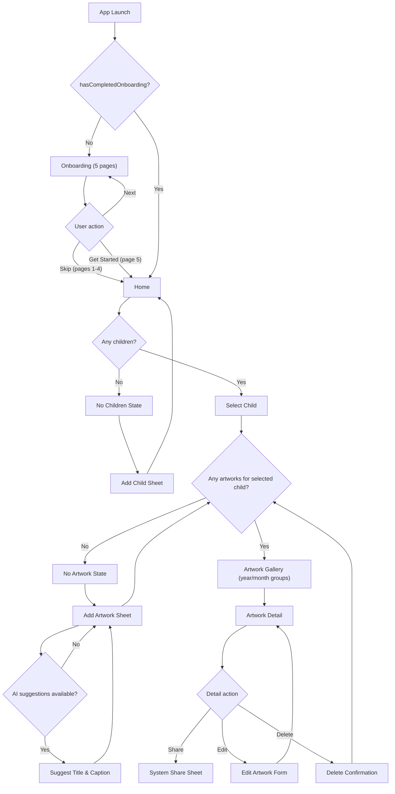

# Little Artist User Flow

This flow is derived from the current SwiftUI implementation.

## Notes
- The floating `Add Artwork` button is shown only when a child is selected.
- Gallery items navigate to `Artwork Detail`.
- `Add Child` and `Add Artwork` are modal sheets from `Home`.
